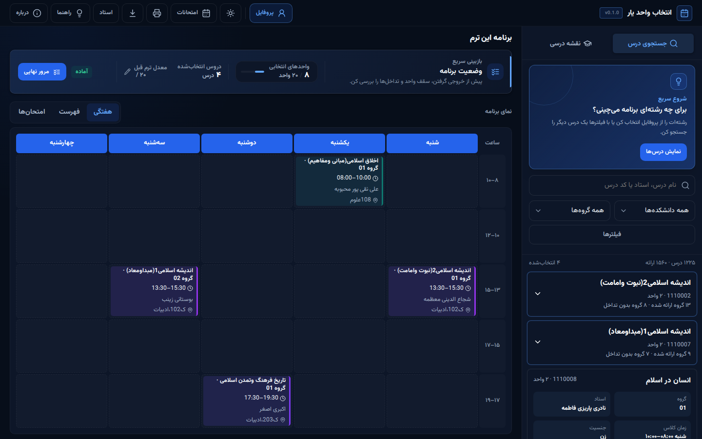

<div align="center">
  <a href="https://github.com/VRUCS/course-planner">
    
  </a>

  <h1>Entekhab Vahed Yar</h1>

  <p>A Persian-first university course planner for building a conflict-aware schedule.</p>

  <p>
    <a href="README.fa.md">فارسی</a>
    ·
    <a href="https://github.com/VRUCS/course-planner/issues">Report a bug</a>
    ·
    <a href="https://github.com/VRUCS/course-planner/issues">Request a feature</a>
  </p>

  <p>
    <a href="https://github.com/VRUCS/course-planner/actions/workflows/ci.yml"></a>
    <a href="LICENSE"></a>
  </p>
</div>

<p align="center">
  
</p>

## Table of Contents

- [About The Project](#about-the-project)
  - [Features](#features)
  - [Built With](#built-with)
- [Getting Started](#getting-started)
  - [Prerequisites](#prerequisites)
  - [Installation](#installation)
  - [Optional AI service](#optional-ai-service)
- [Usage](#usage)
- [Data and privacy](#data-and-privacy)
- [Project structure](#project-structure)
- [Testing](#testing)
- [Roadmap](#roadmap)
- [Contributing](#contributing)
- [License](#license)
- [Contact](#contact)
- [Acknowledgments](#acknowledgments)

## About The Project

Entekhab Vahed Yar (انتخاب واحد یار) helps university students turn course offerings into a practical weekly plan. It combines course search, section comparison, local schedule planning, curriculum progress, and conflict detection in a Persian-first interface.

The main web client is a build-free static application. It can run locally with a simple HTTP server and can be published as a static site on GitHub Pages. An optional FastAPI service provides the AI assistant without exposing provider secrets to the browser.

### Features

- Search courses by name, professor, or course code.
- Filter results by faculty, department, day, units, capacity, gender, availability, and schedule conflicts.
- Keep the profile’s academic program separate from temporary search filters.
- Compare course sections with schedule, professor, capacity, exam, and location details.
- Build a weekly timetable and switch to list or exam views.
- Detect class-time, exam-time, professor, duplicate-course, and unit-limit conflicts.
- Track curriculum and prerequisites using the selected academic profile.
- Export the schedule as an iCalendar file for calendar applications and print it.
- Use the first-visit interactive guide and the optional AI study-planning assistant.
- Store the student profile and schedule locally in the browser; no account is required.

### Built With

- HTML, CSS, and browser-native JavaScript
- [Vazirmatn](https://github.com/rastikerdar/vazirmatn) for the Persian interface
- [FastAPI](https://fastapi.tiangolo.com/) for the optional AI service
- [Node.js](https://nodejs.org/) built-in test runner and [Playwright](https://playwright.dev/) for testing
- [Python](https://www.python.org/), [uv](https://docs.astral.sh/uv/), and [Beautiful Soup](https://www.crummy.com/software/BeautifulSoup/) for data tooling
- GitHub Actions and GitHub Pages for CI and static deployment

## Getting Started

### Prerequisites

- Python 3.12 or newer
- Node.js 22 or newer for development checks and browser tests
- `uv` for Python dependencies, data pipelines, and the optional API
- A modern browser

The web client itself has no frontend build step and does not require an API to plan courses.

### Installation

1. Clone the repository:

   ```bash
   git clone https://github.com/VRUCS/course-planner.git
   cd course-planner
   ```

2. Install development dependencies:

   ```bash
   npm ci
   uv sync --locked
   ```

3. Start the static web client:

   ```bash
   python3 -m http.server 3000 --directory apps/web
   ```

4. Open <http://127.0.0.1:3000> in your browser.

To build the public deployment artifact first, run:

```bash
uv run python tools/build_static.py
python3 -m http.server 3000 --directory _site
```

The build intentionally excludes the local data editor, source data, and backend files from the public artifact.

### Optional AI service

The AI assistant is disabled by default. To run it locally:

1. Copy the example configuration:

   ```bash
   cp apps/api/.env.example apps/api/.env
   ```

2. Set `OPENROUTER_API_KEY`, keep `AI_INTERACTIVE_ENABLED=false` unless you explicitly want to enable the service, and configure the frontend origin.

3. Start the API:

   ```bash
   uv run uvicorn apps.api.main:app --reload --host 127.0.0.1 --port 8000
   ```

Never put `OPENROUTER_API_KEY` or any provider secret in the web client or a public repository.

## Usage

1. Set your faculty, department, cohort, and optional GPA in the academic profile.
2. Search for a course, or choose a faculty and department from the search filters.
3. Review individual sections and add suitable sections to the plan.
4. Use the weekly, list, and exam views to inspect the result.
5. Resolve warnings shown by the planner before finalizing the schedule.
6. Use print or calendar export when the plan is ready.
7. Open the curriculum tab to review passed courses and prerequisite progress.

The profile determines the curriculum view. Search filters are intentionally independent, so a student can temporarily search another department without changing their academic profile.

## Data and privacy

- The static planner does not require login or a database.
- Profile, schedule, curriculum progress, and preferences are stored in the browser’s local storage.
- The optional AI service is a separate backend boundary; provider keys are read only by the server.
- Course and curriculum data should be reviewed against official university sources before being used for enrollment decisions.

## Project structure

```text
apps/web/          Static student and professor web clients
apps/api/          Optional FastAPI AI service
apps/extension/    Browser extension for extracting course data
data/canonical/    Normalized course, curriculum, and conflict data
data/sources/      Source files used by the data pipeline
tools/             Static build and data-pipeline utilities
tests/             Backend, frontend, pipeline, and end-to-end tests
docs/assets/       README screenshots and documentation assets
```

The browser client is organized into domain logic, adapters, shared features, page controllers, generated data wrappers, and styles. See the focused READMEs in [`apps/web`](apps/web/README.md), [`apps/api`](apps/api/README.md), [`data`](data/README.md), and [`tools/data_pipeline`](tools/data_pipeline/README.md) for deeper technical notes. For a developer handoff and continuation workflow, see the [English continuation guide](docs/continuation-guide.en.md) or the [Persian continuation guide](docs/continuation-guide.fa.md).

## Testing

Run the JavaScript unit tests and lint checks:

```bash
npm test
npm run lint
```

Run browser tests:

```bash
npm run test:e2e
```

Run the Python tests and checks:

```bash
uv run python -m pytest -q
uv run ruff check .
```

The complete CI workflow also validates generated data, JavaScript syntax, the static public artifact, and deployment boundaries.

## Roadmap

- Expand verified curriculum mappings from official university charts.
- Add more import adapters for university registration systems.
- Improve schedule sharing and portable plan backups.
- Provide a documented production deployment for the optional AI service.

See the [open issues](https://github.com/VRUCS/course-planner/issues) for current bugs and ideas.

## Contributing

Contributions and focused feedback are welcome.

1. Fork the project.
2. Create a feature branch: `git checkout -b feature/your-feature`.
3. Make the change and add or update tests.
4. Run the relevant checks locally.
5. Commit using a [Conventional Commit](https://www.conventionalcommits.org/) message.
6. Push the branch and open a pull request.

## License

Distributed under the GNU General Public License v3.0. See [`LICENSE`](LICENSE) for details.

## Contact

Project link: <https://github.com/VRUCS/course-planner>

For questions, bug reports, or feature requests, please [open an issue](https://github.com/VRUCS/course-planner/issues).

## Acknowledgments

- [Best-README-Template](https://github.com/othneildrew/Best-README-Template) for the documentation structure.
- [Vazirmatn](https://github.com/rastikerdar/vazirmatn) for the Persian web font.
- [FastAPI](https://fastapi.tiangolo.com/), [Playwright](https://playwright.dev/), and the open-source Python and Node.js communities.
